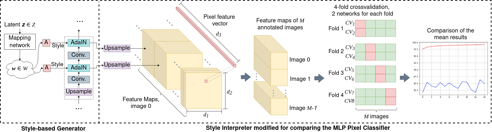
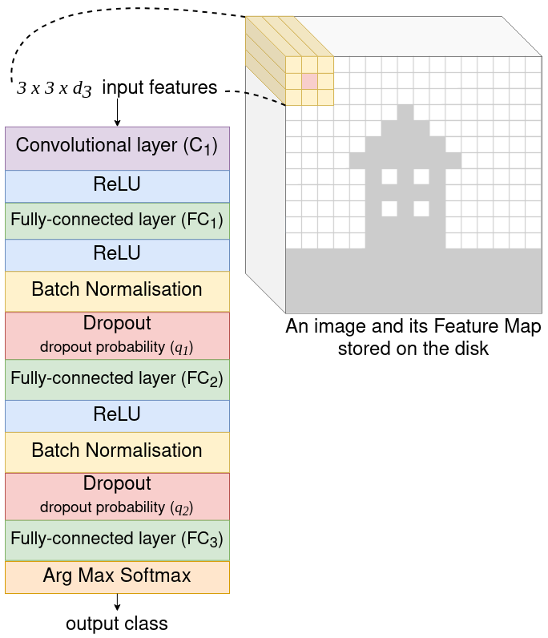
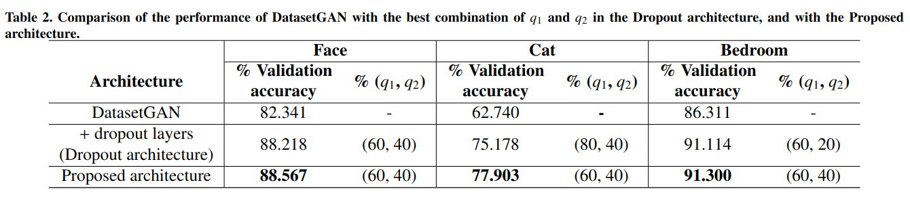
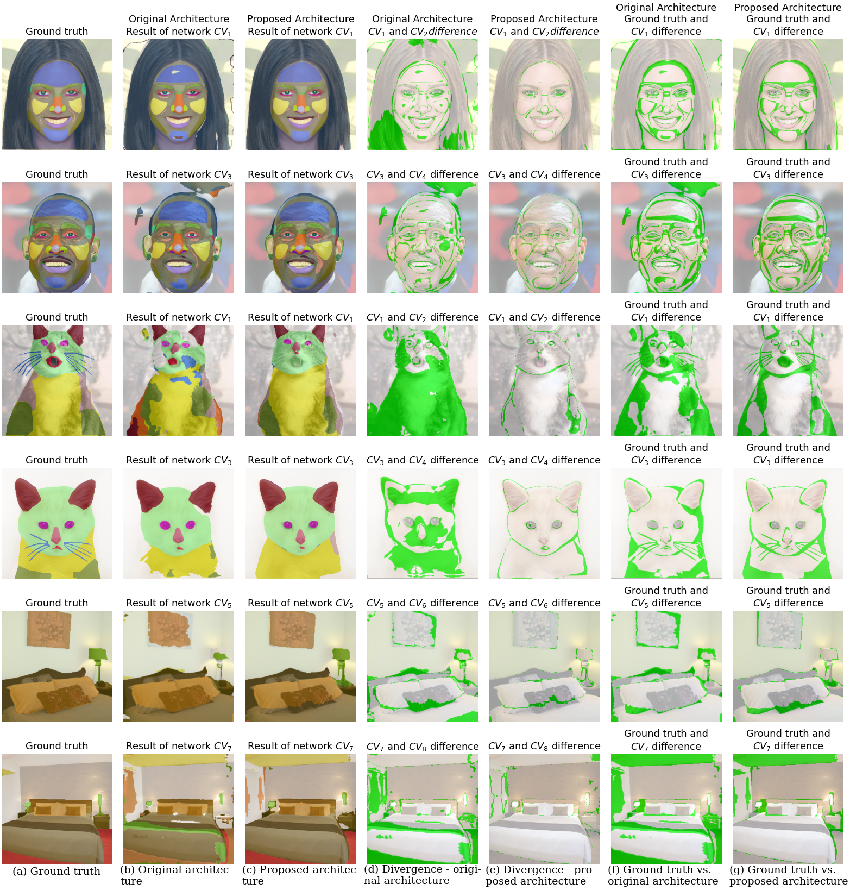

# Enhanced generation of automatically labeled image segmentation datasets by advanced style interpreter deep architectures

**[Pattern Recognition Letters 2025]** **[[paper preview(pending link)]()]**

## Experiment framework


## Proposed Architecture
<p align="center">

</p>

## Main results




## Requirements

This code is tested with:
- Python 3.8
- Pytorch 2.0
- CUDA 11.7 toolkit.

## Replicate the environment

The experiments were conducted using a hybrid environment to solve dependency issues. To reproduce it, first create and acivate a Conda environment as follows:
```
conda env create -f environment_conda.yml
conda activate edgn_c
```
Then, create a virtual environment to manage the remaining libraries with pip as follows:
```
python3 -m venv edgan_p
source edgan_p/bin/activate
python3 -m pip install -r requirements_edgan_p.txt
```

## Download the datasets

- *Download Face and Cat datasets from [DatasetGAN](https://github.com/nv-tlabs/datasetGAN_release)* and put it in the folder `datasetGAN2_release/datasetGAN2/dataset_release/`.  Please be aware that the dataset of DatasetGAN is released under the [Creative Commons BY-NC 4.0](https://creativecommons.org/licenses/by-nc/4.0/) license by NVIDIA Corporation. 

- Download the Bedroom dataset and latents from [Google Drive](https://drive.google.com/drive/folders/1JA4GyZLe6emoOjYGXWEWiYtEPz8VJDtE?usp=sharing)  and make sure to place the dataset and the latents in the same path defined in the file `datasetGAN2_release/datasetGAN2//experiments/bedroom_10.json`.

- *Download pretrained checkpoints from [pytorch checkpoint](https://github.com/nv-tlabs/datasetGAN_release). Put checkpoints in the folder of **./checkpoint/stylegan_pretrain***. Please be aware that the for code dependency and checkpoint related to Stylegan, the license is under the [Creative Commons BY-NC 4.0](https://creativecommons.org/licenses/by-nc/4.0/) license by NVIDIA Corporation.  

**Important**: our code requires that the images inside `datasetGAN2_release/datasetGAN2/dataset_release/annotation/training_data/<dataset_name>/` are in PNG format to work.

## 1. Dropout Architecture experiments

```
cd datasetGAN2_release/datasetGAN2
```

### 1.1. Interpreter 4-fold cross-validation

```
python interpreter_cross_validation.py --n_processes <number_of_GPUs> --fold <fold_index> --exp experiments/<experiment_name>.json --classifier_param experiments/<dropout_configuration>.json --exp_dir model_dir/<dataset_folder>/<experiment_folder>
```

If you are running the experiments for the first time, it is recommended to execute the code above for only one fold and wait for the execution to conclude. Then, the remaining three fold could be executed in parallel. This recommendation is because in the first execution the feature maps will be stored in the disk. After the feature maps are already in disk, the code will not generate them again.

**Important:** The fold index must be a number within [0, 1, 2, 3]. All folds must be executed to perform the 4-fold cross-validation.

Example:
```
python interpreter_cross_validation.py --n_processes 1 --fold 0 --exp experiments/face_34.json --classifier_param experiments/nn_params_dropout_0604.json --exp_dir model_dir/face_34/dropout_60_40
```

### 1.2. Generating qualitative metrics

```
python interpreter_cross_validation.py  --generate_qualitative_results True  --n_processes <number_of_GPUs> --exp experiments/<experiment_name>.json --classifier_param experiments/<dropout_configuration>.json --exp_dir model_dir/<dataset_folder>/<experiment_folder> --output_dir model_dir/<dataset_folder>/<experiment_folder>/visualisation
```
Example:
```
python interpreter_cross_validation.py --generate_qualitative_results True --n_processes 1 --exp experiments/face_34.json --classifier_param experiments/nn_params_dropout_0604.json --exp_dir model_dir/face_34/dropout_60_40 --output_dir model_dir/face_34/dropout_60_40/visualisation
```

## 2. Proposed (Convolutional) Architecture experiments

### 2.1. Interpreter 4-fold cross-validation
```
python train_conv_interpreter_opt.py --exp experiments/<experiment_name>.json  --n_gpus <number_of_GPUs> --fold_run <fold_index> --seed <seed_of_the_network> --float32 True --crossvalidate True
```
Example:
```
python train_conv_interpreter_opt.py --exp experiments/bedroom_10_conv.json  --n_gpus 1 --fold_run 0 --seed 0 --float32 True --crossvalidate True
```
**Important:** 
- The seeds used for the two networks in the folds were 0 and 1 for all datasets experimented in the paper.
- The fold index must be a number within [0, 1, 2, 3].

### 2.2. Generate quantitative results
The results are generated for each network for each epoch.
```
python train_conv_interpreter_opt.py ---exp experiments/<experiment_name>.json  --results_epoch <epoch_wth_the_best_results> --n_gpus <number_of_GPUs> --fold_run -1 --float32 True --output_dir /your/local/path/
```
Example:
```
python train_conv_interpreter_opt.py --exp experiments/cat_16_conv.json  --results_epoch 1 --n_gpus 2 --fold_run -1 --generate_metrics True --float32 True --output_dir /your/local/path/
```

### 2.3. Generate qualitative results
The results are generated for each network for each epoch.
```
python train_conv_interpreter_opt.py --exp experiments/<experiment_name>.json  --results_epoch <epoch_wth_the_best_results> --n_gpus <number_of_GPUs> --fold_run -1 --float32 True --generate_qualitative_results True --output_dir <path_to_save_the_results>
```
Example:
```
python train_conv_interpreter_opt.py --exp experiments/cat_16_conv.json  --results_epoch 1 --n_gpus 1 --fold_run -1 --float32 True --generate_qualitative_results True --output_dir /your/local/path/
```

## Citations

Please include cite us if you use our data or code:

<code style="color : red">Pending</code> 


## Acknowledgments

This work is partially supported by the Ministry of Science and Innovation of Spain [grant number PID2022-136764OA-I00], project name Automated Detection of Non Lesional Focal Epilepsy by Probabilistic Diffusion Deep Neural Models. It is also partially supported by the Autonomous Government of Andalusia (Spain) under project UMA18-FEDERJA-084, project name Detection of anomalous behavior agents by deep learning in low-cost video surveillance intelligent systems. All of them include funds from the European Regional Development Fund (ERDF). The authors thankfully acknowledge the computer resources, technical expertise, and assistance provided by the SCBI (Supercomputing and Bioinformatics) center of the University of Málaga. The authors acknowledge the funding from the Universidad de Málaga. No conflict of interest has been declared by the authors.

## License

For any code dependency related to Stylegan, the license is under the [Creative Commons BY-NC 4.0](https://creativecommons.org/licenses/by-nc/4.0/) license by NVIDIA Corporation.  To view a copy of this license, visit [LICENSE](https://github.com/NVlabs/stylegan/blob/master/LICENSE.txt ).

The code dependency related to DatasetGAN is under the MIT license. See [LICENSE](https://github.com/nv-tlabs/datasetGAN_release/blob/master/LICENSE.txt) for additional details.

For the datasets of DatasetGAN, the license is under the [Creative Commons BY-NC 4.0](https://creativecommons.org/licenses/by-nc/4.0/) license by NVIDIA Corporation. You can **use, redistribute, and adapt** the material for **non-commercial purposes**, as long as you give appropriate credit by **citing our paper** and **indicating any changes** that you've made.
